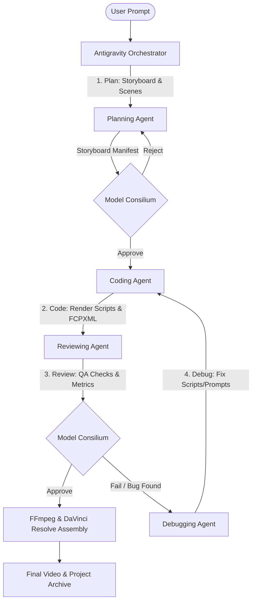

# 🎬 Multi-Agent Video Orchestration Skill

This skill defines the complete pipeline and task structure for orchestrating professional cinematic video production (using Google Veo 3.1) via a decentralized mesh of background subagents delegating **Planning**, **Coding**, **Reviewing**, and **Debugging** tasks.

It implements the **R-A-L-P-H Loop**, **Model Consilium** voting, and **5-Minute Auto-Research** latency updates.

---

## 🛰️ Multi-Agent Architecture Mesh



---

## 🔁 Step-by-Step Orchestration Protocol (RALPH Loop)

### Phase 1: Cognitive Retrieval (Retrieve)
1. **Model Mesh Evaluation**: Load weight matrices from `.state/model-mesh-weights.json` (compiled by `scripts/mesh-autoresearch-5min.sh`).
2. **Context Sync**: Pull the latest project state and design constraints from `memory-mcp` and `supermemory` (`serpentos` tag).
3. **NotebookLM Validation**: Run `bash scripts/nb-advisor.sh "video production"` to align with current model properties and limitations.

### Phase 2: Orchestration & Delegation (Act)
1. **Planning Subagent**: 
   - Generates character style prompts, camera motion directions, and scene durations.
   - Run Model Consilium: `python3 scripts/consilium.py "Verify storyboard plans for Run ID"` to get sign-off.
2. **Coding Subagent**:
   - Generates the generation payload manifests and the Python run commands (`google-genai` SDK or `veo3_vertex_pipeline.py`).
   - Generates the FCPXML edit timeline configuration and FFmpeg concatenation parameters.
3. **Reviewing (QA Critic) Subagent**:
   - Executes dry-run validation checks on aspect ratios, continuous motion requirements, and negative prompt filtering.
   - Run Model Consilium: `python3 scripts/consilium.py "QA critique on generated script files"` to get execution permission.
4. **Debugging Subagent**:
   - If rendering or generation outputs fail check (e.g. `ffprobe` errors or static frame detection), this subagent rewrites prompts/commands and runs failover iterations.

### Phase 3: Assembly & Validation (Learn & Persist)
1. **Stitch Master**: Compile final cuts via FFmpeg sequential processing to prevent M1 RAM swaps.
2. **Resolve Import**: Trigger DaVinci Resolve timeline import via `davinci-mcp` configuration.
3. **State Logging**: Record performance statistics, latency metrics, and API token usage in `OS-NOTES.md` and Chroma DB.

---

## 🛠️ Required MCP & Plugin Stack

| MCP Server / Plugin | Purpose | Critical Tools |
|---|---|---|
| `gcp-video-mcp` | Direct connection to Google Vertex AI Veo 3.1 | `generate_veo_clip` |
| `davinci-resolve-mcp` | Timeline assembly, clip importing, NLE control | `import_clips`, `assemble_timeline` |
| `github-mcp-server` | Multi-agent branching, script staging, PR creation | `create_branch`, `create_or_update_file` |
| `memory-mcp` | Direct read/write to Chroma vector store and Obsidian | `chroma_add`, `obsidian_write` |
| `supermemory` | Deep storage of cross-session decisions and weights | `memory` (action="save") |
| `chrome-devtools-mcp` | Automated preview inspection of storyboard assets | `take_screenshot`, `evaluate_script` |

---

## 💻 Video Pipeline Execution Command

Run the complete multi-agent pipeline using the designated launcher wrapper under Doppler:
```bash
doppler run --project serpent --config prd -- python3 scripts/orchestrate_video_pipeline.py --run-id "auto_$(date +%Y%m%d)"
```

---

## 📋 Definition of Done (DoD)
- [ ] Weight matrix successfully queried from `.state/model-mesh-weights.json`.
- [ ] Storyboard plan approved by a Model Consilium (llama-3.3-70b, gemini-2.5-flash, deepseek-v3.1).
- [ ] Staged scripts compiled successfully without type errors.
- [ ] QA checks verify 25 fps, 1080p rendering with continuous movement.
- [ ] Handoff documentation saved in `OS-NOTES.md`.
